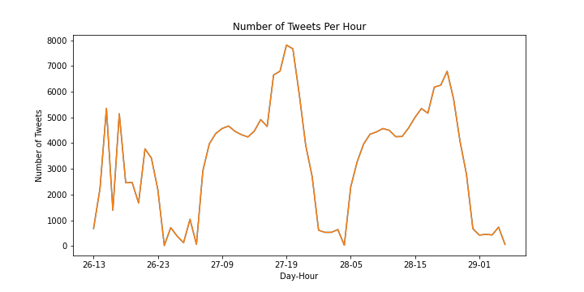
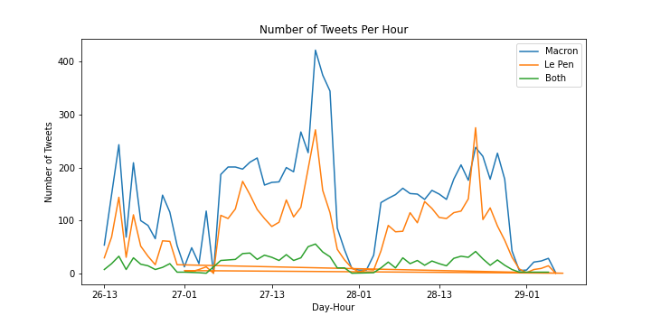

# FrenchElectionTweets
An analysis of tweets surrounding the French presidential election of 2017.

## Personna
Our audience is Dr. Lancaster. She is a Distinguished Professor of Sociology at École Polytechnique in Palaiseau, France, studying political participation. She's comfortable with frequentist statistics and has little interest in coding.

## Background
The election of 2017 is noteworthy because neither Marine Le Pen nor Emmanuel Macron won a majority in the initial round that took place on April 23rd -- Marine Le Pen represented the National Front party, and Emmanuel Macron represented the En Marche! party. 

In the second round of voting that took place on May 7th, Emmanuel Macron won by a clear margin. A total of 43.6% of registered voters chose Macron.

The data set is a collection of tweets spanning four days following the first election: April 26th through April 29. The tweets from this time period may be important to questions related to political participation because it was an especially close race. Further, the tweets might reflect shifting sentiment related to the candidates, their parties, and platforms.

## Time-Series Analysis
Our analysis began by breaking down the number of tweets per hour during the dates in question.

There appear to be intra-day trends with the lowest frequencies of tweets happening between midnight and 5am, but otherwise no noteworthy trends across days.

## Relative Mentions
Next, we examined the number of times each candidate was mentioned. 

The data show overall that Emmanual Macron has greater mentions across time in comparison to Marine Le Pen. Also, note the green data path that depicts tweets in which both were mentioned. It's low in comparison to the other two, suggesting that Macron's advantage cannot simply be accounted for by tweets that mention both candidates.

## Conclusion
Overall, the data show Macron had a greater presence on Twitter as comparison to his rival, Le Pen. The correspondence between this and the outcome of the election is interesting and worth further investigation.

## Limitations and Future Directions
This analysis is naive with respect to the content of the tweets, but according to the old addage 'all publicity is good publicity', the total number of mentions may reflect each candidate's relative standing in the electorate.

Still, with additional financial support, we could conduct a lexical and sentiment analyses of the content of the tweet, which would provide a richer picture of voter participation. Further, network analyses might reveal which messages from either party were most important and widely disseminated. Finally, future elections should be monitored in a similar way to see if the relationship between twitter mentions and election outcome is consistent and replicable.
